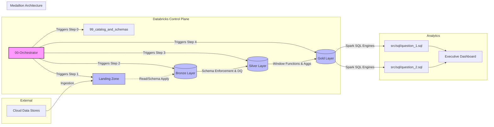

# NYC Yellow Taxi Analytics Pipeline

An end-to-end cloud-native data engineering pipeline that ingests, processes, sanitizes, and aggregates NYC TLC Yellow Taxi trip data using the Medallion Architecture over Delta Lake. This project delivers an automated execution framework coupled with executive dashboards to answer critical business intelligence metrics.

---

## Architecture Overview

The platform is engineered using the Medallion Lakehouse Architecture, decoupling compute from storage while ensuring ACID transactions and schema enforcement.



1. **Landing Zone (Staging Area):** Raw parquet partition collector ingestion directly from cloud data stores.
2. **Bronze Layer (Raw Ingestion):** Append-only historical repository. Maps incoming source matrices directly to Delta Lake format while embedding systematic data-lineage metadata.
3. **Silver Layer (Single Source of Truth):** Data Quality (DQ) layer executing precise validation gates. Filters out anomalies (negative fares, invalid timestamps outside bounds, and zero-passenger records) and enforces strict schemas.
4. **Gold Layer (Semantic / Consumption Hub):** Highly optimized analytical star schemas and specialized aggregation window views tailored to target business rules.

### Physical Tuning and Performance Optimization
To mitigate the Small File Problem common in distributed network systems, partitioning was replaced by Delta Lake Z-Order Clustering along chronological query dimensions (DAY_SLICE, HOUR_SLICE). This minimizes network shuffle and enables data-skipping performance on analytical rendering.

---

## Repository Structure

The code is strictly decoupled into reusable modules, localized SQL scripts, and independent executable environments inside the source directory (src):

```text
    ifood-yellow-taxi-analytics/
    ├── src/
    │   ├── modules/
    │   │   ├── __init__.py
    │   │   └── data_ingestion.py        # Core extraction modules
    │   ├── notebooks/
    │   │   ├── 00-orchestrator.ipynb           # Control Plane / DAG Orchestrator
    │   │   ├── 01_ingestion_to_landing_zone.ipynb
    │   │   ├── 02_landing_zone_to_bronze.ipynb
    │   │   ├── 03_bronze_to_silver.ipynb
    │   │   ├── 04_silver_to_gold.ipynb
    │   │   └── 99_catalog_and_schemas.ipynb       # Environment bootstrapping
    │   ├── sql/
    │   │   ├── question_1.sql          # Monthly Revenue Query
    │   │   └── question_2.sql          # Passenger Density Analytics
    │   └── constants.py                # Centralized Configuration & Schemes
    ├── README.md
    └── requirements.txt
```

## Orchestration and Execution

Workflow dependencies are automated through a centralized Master DAG Orchestrator (`00-orchestrator.ipynb`). It abstracts child execution nodes via Spark session isolation hooks, ensuring transactional failure recovery.

### Running the Project in Databricks:
1. Link your GitHub account to the workspace via Git Folders or Personal Access Tokens (PAT).
2. Open `src/notebooks/00-orchestrator.ipynb` and trigger **Run All**.
3. The control plane will dynamically trigger the execution flow in sequence, starting with database initialization followed by the data lifecycle stages, logging metadata checkpoints at each step.

### Pipeline Dependencies and DAG Sequence

The execution workflow follows a strict sequential order to respect data dependencies between the Medallion layers:

* **Step 0: `99_catalog_and_schemas.ipynb`**: Initial bootstrap environment check triggered by the orchestrator. Executes DDL commands to ensure metastore databases and target schemas exist prior to ingestion.
* **Step 1: `01_ingestion_to_landing_zone.ipynb`**: Connects to source endpoints and secures raw files locally.
* **Step 2: `02_landing_zone_to_bronze.ipynb`**: Consumes raw data, applies transaction metadata, and writes to raw Delta tables.
* **Step 3: `03_bronze_to_silver.ipynb`**: Performs schema enforcement, deduplication, and quality-gate filtering.
* **Step 4: `04_silver_to_gold.ipynb`**: Computes standard multi-dimensional matrices and specialized analytical aggregates.

---

## Business Intelligence and Analytics

The analytical engine feeds an integrated, native Databricks executive dashboard by parsing decoupled raw SQL files from `src/sql/` straight into active Spark DataFrames. This separation ensures that reporting queries are version-controlled assets independent of notebook layout configurations.

### Target Deliverables Answered:
* **Question 1 (Monthly Revenue Analytics):** Computes the total monthly revenue (`total_amount`) across the entire fleet from January to May, plotting actual performance against the historical monthly baseline via a custom combo chart.
* **Question 2 (Passenger Density Analytics):** Utilizes specialized Window Functions to calculate customer densities and average passenger counts grouped by hour of the day specifically for the month of May, mapping behavioral patterns against global trend lines.

---

## Governance and Development Standards

This repository adheres to production-grade software development lifecycle (SDLC) parameters:

* **Portable Execution Context:** Workspace runtime environments use dynamic path injection via `sys.path.append(os.path.abspath('..'))`. This removes hardcoded user workspace paths, making the repository fully portable across different cluster environments or evaluators.
* **Conventional Commits:** Git commit history strictly complies with the global structured specification (e.g., `feat:`, `fix:`, `docs:`, `perf:`). This standard ensures transparent changelogs and robust audibility for version-controlled data infrastructure.
* **ACID and Schema Evolution:** Storage engines use Delta Lake protocols to provide transactional consistency, time-travel auditing capability, and explicit schema evolution handling across data cycles.


